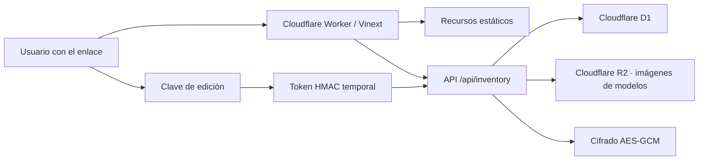

# Guía técnica

## 1. Arquitectura



Las lecturas son públicas. Para modificar datos, `POST /api/write-access`
compara la clave recibida con el secreto del Worker y entrega un token HMAC con
vencimiento. La interfaz conserva el token únicamente en memoria y lo envía en
cada escritura. Recargar la página lo elimina, aunque todavía no haya vencido.

La interfaz y la API forman una sola aplicación Vinext. Los archivos estáticos
se sirven mediante el binding `ASSETS`, los datos estructurados mediante el
binding D1 `DB` y las imágenes subidas mediante el binding R2 `DEVICE_IMAGES`.

## 2. Componentes principales

| Ruta | Responsabilidad |
| --- | --- |
| `app/InventoryApp.tsx` | Interfaz, lector USB/cámara, exportación, formularios, filtros y vista previa CSV. |
| `app/api/inventory/route.ts` | Consultas, validaciones, permisos y operaciones de inventario. |
| `app/api/device-models/route.ts` | Edición de fichas técnicas y carga o reemplazo de imágenes. |
| `app/api/device-model-images/route.ts` | Lectura pública y transmisión de imágenes desde R2. |
| `app/api/write-access/route.ts` | Validación de la clave compartida y emisión del permiso temporal. |
| `lib/device-models.ts` | Clave normalizada que relaciona tipo y modelo con su ficha. |
| `lib/inventory-csv.ts` | Lectura, normalización y transformación de archivos CSV. |
| `lib/inventory-auth.ts` | Identidad anónima de lectura usada por compatibilidad interna. |
| `lib/write-access.ts` | Comparación segura, firma HMAC, vencimiento y validación de escritura. |
| `lib/inventory-crypto.ts` | Cifrado y descifrado AES-GCM de credenciales. |
| `db/schema.ts` | Esquema Drizzle para D1/SQLite. |
| `drizzle/` | Migraciones SQL y metadatos de Drizzle Kit. |
| `worker/index.ts` | Entrada del Cloudflare Worker. |
| `wrangler.jsonc` | Worker, bindings, variables y despliegue de producción. |
| `.openai/hosting.json` | Binding lógico usado por el flujo de compilación Sites/Vinext. |
| `tests/rendered-html.test.mjs` | Pruebas de renderizado, seguridad estructural y CSV. |

El lector por cámara carga `@zxing/browser` solo al abrir el diálogo. Solicita
`getUserMedia` con preferencia por la cámara trasera y decodifica el video en el
navegador; no transmite imágenes a la API ni las guarda en D1.

## 3. Modelo de datos

### `users`

Tabla heredada de identidades internas y roles. No participa en el modo actual
de clave compartida y se conserva para no alterar movimientos históricos.

Campos principales: `email`, `display_name`, `role`, `active`.

Roles válidos: `admin`, `operator`, `viewer`.

### `stores`

Catálogo oficial de tiendas.

- `store_number` es único.
- `name` contiene el nombre oficial.

### `equipment`

Tabla central para equipos y materiales.

| Campo | Uso |
| --- | --- |
| `barcode` | No. de Serie o código interno; es único. |
| `model` | Modelo o descripción principal. |
| `device_type` | Tipo de equipo o material. |
| `item_kind` | `equipment` o `material`. |
| `quantity` | `1` para equipos; entero positivo para materiales. |
| `received_at` | Fecha ISO; cadena vacía significa fecha desconocida. |
| `delivered` | Estado de entrega. |
| `condition` | `working`, `not_working` o `unknown`. |
| `store_id` | Relación opcional con una tienda oficial. |
| `store_reference` | Código o nombre importado todavía sin relacionar. |
| `is_network_device` | Indica si la ficha debe habilitar MAC, IP y credencial; no depende de que esos valores estén completos. |
| `credential_ciphertext` | Contraseña cifrada; nunca contiene texto plano. |
| `created_by`, `updated_by` | Usuario responsable del cambio. |

### `equipment_movements`

Auditoría de acciones: `received`, `updated`, `delivered`, `returned` e
`imported`.

Cada movimiento conserva artículo, tienda, usuario, detalles y fecha.

Al eliminar un artículo, la clave foránea `equipment_movements.equipment_id`
aplica `ON DELETE CASCADE`: también se eliminan sus movimientos. La operación
no afecta la tabla de tiendas ni otros artículos.

### `device_model_profiles`

Información compartida por todos los equipos del mismo tipo y modelo. La clave
normalizada `catalog_key` es única y evita duplicar una ficha por diferencias
de mayúsculas, espacios o tildes.

| Campo | Uso |
| --- | --- |
| `device_type`, `model` | Identidad visible del modelo existente en inventario. |
| `manufacturer` | Marca o fabricante opcional. |
| `description` | Descripción operativa del modelo. |
| `specifications` | Información técnica en texto libre. |
| `image_key` | Clave del objeto guardado en R2; D1 no almacena los bytes. |
| `image_content_type` | Tipo MIME validado de la imagen. |

Las fichas se muestran junto con conteos calculados desde `equipment`. Se
aceptan imágenes JPG, PNG y WebP de hasta 5 MB. Al reemplazar o quitar una
imagen, el objeto anterior se elimina de R2.

## 4. Acceso de lectura y escritura

No se usa Cloudflare Access, correo ni cuenta de usuario.

### Lectura pública

`GET /api/inventory` y las imágenes de modelos pueden consultarse sin token.
La respuesta no contiene contraseñas de equipos y la exportación CSV también
las excluye.

### Clave compartida

`INVENTORY_WRITE_PASSWORD` se configura como secreto del Worker. Debe tener al
menos 12 caracteres. La API calcula SHA-256 para comparar la clave mediante
`crypto.subtle.timingSafeEqual`; el valor real no se devuelve ni se escribe en
logs o en D1.

Cuando coincide, el servidor emite un token firmado con HMAC-SHA-256 que
incluye vencimiento y un nonce aleatorio. Su duración predeterminada es 30
minutos y puede ajustarse con `INVENTORY_WRITE_ACCESS_MINUTES`.

### Validación de cada cambio

Las rutas de inventario y fichas de modelos exigen:

```text
Authorization: Bearer <token-temporal>
```

Ocultar botones no es la medida de seguridad: el servidor valida firma y
vencimiento antes de procesar cada `POST`. El token vive en una referencia de
React, no en `localStorage`, `sessionStorage` ni cookies. Por eso recargar la
página vuelve al modo de consulta. También se puede invalidar localmente con el
botón **Edición activa · Bloquear**.

## 5. Cifrado de contraseñas

`INVENTORY_ENCRYPTION_KEY` se procesa con SHA-256 para derivar una clave AES.
Cada contraseña se cifra con AES-GCM y un IV aleatorio de 12 bytes. El IV y el
texto cifrado se guardan juntos en Base64.

Reglas operativas:

- la clave debe tener al menos 24 caracteres;
- debe configurarse como secreto, no como texto en Git;
- debe respaldarse en un gestor de secretos seguro;
- cambiarla impide descifrar credenciales creadas con la clave anterior.

Configuración en Cloudflare:

```bash
npx wrangler secret put INVENTORY_ENCRYPTION_KEY --config wrangler.jsonc
```

## 6. Variables y bindings

| Nombre | Tipo | Uso |
| --- | --- | --- |
| `DB` | D1 binding | Base `inventario-dollar-db`. |
| `ASSETS` | Assets binding | Archivos compilados de la interfaz. |
| `DEVICE_IMAGES` | R2 binding | Imágenes de las fichas de modelos. |
| `INVENTORY_WRITE_ACCESS_MINUTES` | Variable | Duración del permiso temporal; actualmente `30`. |
| `INVENTORY_WRITE_PASSWORD` | Secreto | Clave compartida para autorizar escrituras. |
| `INVENTORY_ENCRYPTION_KEY` | Secreto | Clave para cifrar credenciales. |

`.env.example` documenta nombres y valores de ejemplo. Para desarrollo local se
puede copiar a `.dev.vars` y reemplazar los valores; `.dev.vars` está ignorado
por Git.

## 7. Preparar el entorno

```bash
git clone https://github.com/GersonPc/inventario-dollar.git
cd inventario-dollar
npm install
```

En PowerShell:

```powershell
Copy-Item .env.example .dev.vars
```

Edita `.dev.vars` únicamente en tu equipo. Después:

```bash
npm run dev
```

La consulta pública no debe devolver contraseñas ni otros secretos. En local,
la edición permanece bloqueada hasta definir `INVENTORY_WRITE_PASSWORD` en
`.dev.vars`.

## 8. Cambios de base de datos

1. Modifica `db/schema.ts`.
2. Genera la migración:

   ```bash
   npm run db:generate
   ```

3. Revisa el SQL nuevo en `drizzle/`.
4. Prueba la migración localmente:

   ```bash
   npx wrangler d1 migrations apply inventario-dollar-db --local --config wrangler.jsonc
   ```

5. Ejecuta pruebas.
6. Crea un respaldo remoto.
7. Aplica las migraciones remotas:

   ```bash
   npm run db:migrate:cloudflare
   ```

8. Publica el Worker.

Cloudflare distingue `--local` y `--remote`; confirma siempre cuál aparece en
la salida antes de continuar. Consulta la
[documentación oficial de migraciones D1](https://developers.cloudflare.com/d1/reference/migrations/).

## 9. Respaldo de D1

Antes de una migración o importación grande:

```powershell
New-Item -ItemType Directory -Force outputs/backups
```

```bash
npx wrangler d1 export inventario-dollar-db --remote --config wrangler.jsonc --output outputs/backups/inventario-dollar.sql
```

El directorio `outputs/` está ignorado por Git. Aun así, mueve el respaldo a un
almacenamiento seguro porque puede contener datos internos y credenciales
cifradas.

No ejecutes un respaldo SQL directamente sobre la base activa sin revisar su
contenido y planificar la restauración. Para incidentes de producción, utiliza
las opciones de recuperación de D1 o restaura primero en una base separada.

## 10. API de inventario

### `GET /api/inventory`

Devuelve:

- identidad pública de compatibilidad;
- hasta 5,000 artículos;
- catálogo de tiendas;
- fichas técnicas de tipos y modelos;
- lista de usuarios vacía.

### `POST /api/write-access`

Recibe la clave compartida y, si es correcta, devuelve un token HMAC temporal,
su vencimiento y la duración configurada. Rechaza orígenes diferentes, cuerpos
excesivos y claves incorrectas. La respuesta utiliza `cache-control: no-store`.

### `POST /api/inventory`

El cuerpo contiene un campo `action`.

| Acción | Protección | Función |
| --- | --- | --- |
| `saveEquipment` | Token temporal | Crea o actualiza un equipo/material y su movimiento. |
| `saveStore` | Token temporal | Crea o actualiza una tienda por número. |
| `importStores` | Token temporal | Crea o actualiza hasta 5,000 tiendas desde un listado CSV validado. |
| `importCsv` | Token temporal | Procesa hasta 5,000 registros preparados por la interfaz. |
| `deleteEquipment` | Token temporal | Elimina el artículo y sus movimientos relacionados. |

La API valida nuevamente el token; no depende del estado visual de los botones.

### `POST /api/device-models`

Recibe `multipart/form-data` con tipo, modelo, marca, descripción,
especificaciones y una imagen opcional. Requiere el mismo token temporal de
edición. Guarda el texto en D1 y los bytes de la imagen en R2.

### `GET /api/device-model-images?key=...`

Valida la forma de la clave antes de transmitir el objeto público desde R2.
Incluye tipo de contenido, ETag, caché privada y `nosniff` en la respuesta.

## 11. Importación CSV

El navegador transforma el archivo con `mapInventoryCsv` antes de enviarlo a la
API. La API valida cada registro, resuelve la tienda, cifra credenciales y hace
upsert por `barcode`.

La importación actual procesa las filas secuencialmente y devuelve:

- `createdCount`;
- `updatedCount`;
- `skippedCount`;
- hasta 20 mensajes de error.

El listado independiente de tiendas se procesa con `mapStoresCsv`. La API
deduplica números dentro del archivo y conserva el `id` de las tiendas
existentes al actualizar su nombre, por lo que no rompe las relaciones con
`equipment.store_id`.

Las reglas completas están en [Formato e importación CSV](FORMATO_CSV.md).

## 12. Pruebas y validación

```bash
npm run lint
npm test
```

`npm test` realiza una compilación de producción y verifica:

- renderizado del HTML;
- bindings y almacenamiento durable;
- cifrado y permisos temporales de edición;
- plantilla CSV;
- parsing del formato de bodega;
- series científicas únicas;
- material por cantidad;
- captura continua;
- catálogo de dispositivos y binding R2 para imágenes;
- ausencia de cuentas y de almacenamiento del token en el navegador.

Una publicación no debe continuar si falla lint, compilación o pruebas.

## 13. Despliegue

Para un cambio sin migración:

```bash
npm run deploy:cloudflare
```

Antes del primer despliegue de este modo, configura la clave mediante la entrada
interactiva de Wrangler:

```bash
npx wrangler secret put INVENTORY_WRITE_PASSWORD --config wrangler.jsonc
```

Para un cambio con migración:

```bash
npm run lint
npm test
npm run db:migrate:cloudflare
npm run deploy:cloudflare
```

El comando de despliegue no aplica migraciones automáticamente. Esta separación
es intencional para permitir revisar y respaldar la base antes del cambio.

La URL de producción esperada es:

```text
https://inventario-dollar.fybertechdisney.workers.dev
```

## 14. Flujo Git

```bash
git pull --ff-only
git switch -c feature/nombre-corto
# realizar cambios
npm run lint
npm test
git add <archivos>
git commit -m "Describe el cambio"
git push -u origin feature/nombre-corto
```

Después se abre un pull request hacia la rama base acordada.

No subas:

- `.dev.vars` ni archivos `.env` reales;
- respaldos D1;
- CSV de inventario real;
- contraseñas o tokens;
- contenido de `.wrangler/` o `outputs/`.

## 15. Evolución futura

El modo actual no identifica quién realizó cada modificación; los campos de
actor quedan en `NULL`. Si después se necesitan usuarios individuales,
atribución por persona, recuperación de clave o permisos diferentes, habrá que
reemplazar la clave compartida por un proveedor de identidad y enlazar sus
identificadores con la tabla `users`. Ese cambio no es necesario para el flujo
interno solicitado actualmente.
