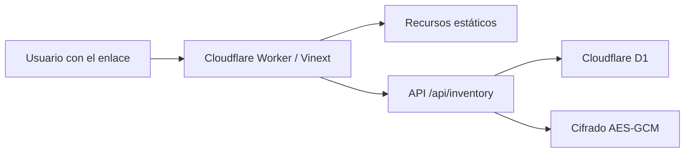

# Guía técnica

## 1. Arquitectura



Mientras se integra Entra ID, el Worker opera con
`INVENTORY_PUBLIC_ACCESS=true`. El servidor asigna una identidad temporal de
rol `operator` a las solicitudes sin sesión: permite las operaciones de bodega
pero no revelar contraseñas ni administrar usuarios. Cualquier persona con la
URL puede modificar el inventario durante este periodo.

La interfaz y la API forman una sola aplicación Vinext. Los archivos estáticos
se sirven mediante el binding `ASSETS` y los datos mediante el binding D1 `DB`.

## 2. Componentes principales

| Ruta | Responsabilidad |
| --- | --- |
| `app/InventoryApp.tsx` | Interfaz, formularios, lector, filtros y vista previa CSV. |
| `app/api/inventory/route.ts` | Consultas, validaciones, permisos y operaciones de inventario. |
| `lib/inventory-csv.ts` | Lectura, normalización y transformación de archivos CSV. |
| `lib/inventory-auth.ts` | Acceso público temporal, usuario interno, roles y autorización de escritura. |
| `app/chatgpt-auth.ts` | Validación del JWT de Cloudflare Access para la siguiente fase con Entra ID. |
| `lib/inventory-crypto.ts` | Cifrado y descifrado AES-GCM de credenciales. |
| `db/schema.ts` | Esquema Drizzle para D1/SQLite. |
| `drizzle/` | Migraciones SQL y metadatos de Drizzle Kit. |
| `worker/index.ts` | Entrada del Cloudflare Worker. |
| `wrangler.jsonc` | Worker, bindings, variables y despliegue de producción. |
| `.openai/hosting.json` | Binding lógico usado por el flujo de compilación Sites/Vinext. |
| `tests/rendered-html.test.mjs` | Pruebas de renderizado, seguridad estructural y CSV. |

## 3. Modelo de datos

### `users`

Identidades internas y roles.

Campos principales: `email`, `display_name`, `role`, `active`.

Roles válidos: `admin`, `operator`, `viewer`.

### `stores`

Catálogo oficial de tiendas.

- `store_number` es único.
- `name` contiene el nombre oficial.

### `equipment`

Tabla central para equipos y materiales.

| Campo | Uso |
| --- | --- |
| `barcode` | No. de Serie o código interno; es único. |
| `model` | Modelo o descripción principal. |
| `device_type` | Tipo de equipo o material. |
| `item_kind` | `equipment` o `material`. |
| `quantity` | `1` para equipos; entero positivo para materiales. |
| `received_at` | Fecha ISO; cadena vacía significa fecha desconocida. |
| `delivered` | Estado de entrega. |
| `condition` | `working`, `not_working` o `unknown`. |
| `store_id` | Relación opcional con una tienda oficial. |
| `store_reference` | Código o nombre importado todavía sin relacionar. |
| `credential_ciphertext` | Contraseña cifrada; nunca contiene texto plano. |
| `created_by`, `updated_by` | Usuario responsable del cambio. |

### `equipment_movements`

Auditoría de acciones: `received`, `updated`, `delivered`, `returned` e
`imported`.

Cada movimiento conserva artículo, tienda, usuario, detalles y fecha.

## 4. Autenticación y autorización

### Modo público temporal

`INVENTORY_PUBLIC_ACCESS=true` evita consultar identidad y devuelve el usuario
efímero `public-access` con rol `operator`. La API oculta la lista de usuarios y
rechaza las acciones internas de gestión de usuarios en este modo.

### Cloudflare Access (preparado para reactivarse)

El Worker recibe el encabezado `cf-access-jwt-assertion`. La aplicación:

1. obtiene las claves públicas desde el dominio del equipo de Access;
2. verifica firma, emisor y audiencia;
3. extrae correo y sujeto;
4. construye el identificador interno `cloudflare:<sub>`.

La aplicación no acepta el correo enviado por el navegador como prueba de
identidad; utiliza el token firmado por Access.

### Autorización interna

Cuando se desactive el modo público, después de validar la identidad:

1. busca el identificador en `users`;
2. si no existe, busca por correo para enlazar una autorización previa;
3. si sigue sin existir, permite crear únicamente el correo definido en
   `INVENTORY_ADMIN_EMAIL`;
4. cualquier otro correo recibe `401` aunque Access lo haya autenticado.

La administración visual de usuarios está retirada durante la migración a
Microsoft, pero la API conserva las acciones internas de roles y usuarios para
compatibilidad temporal.

### Permisos del servidor

- `admin`: lectura, escritura y revelado de contraseñas.
- `operator`: lectura y escritura.
- `viewer`: solamente lectura.

## 5. Cifrado de contraseñas

`INVENTORY_ENCRYPTION_KEY` se procesa con SHA-256 para derivar una clave AES.
Cada contraseña se cifra con AES-GCM y un IV aleatorio de 12 bytes. El IV y el
texto cifrado se guardan juntos en Base64.

Reglas operativas:

- la clave debe tener al menos 24 caracteres;
- debe configurarse como secreto, no como texto en Git;
- debe respaldarse en un gestor de secretos seguro;
- cambiarla impide descifrar credenciales creadas con la clave anterior.

Configuración en Cloudflare:

```bash
npx wrangler secret put INVENTORY_ENCRYPTION_KEY --config wrangler.jsonc
```

## 6. Variables y bindings

| Nombre | Tipo | Uso |
| --- | --- | --- |
| `DB` | D1 binding | Base `inventario-dollar-db`. |
| `ASSETS` | Assets binding | Archivos compilados de la interfaz. |
| `CF_ACCESS_TEAM_DOMAIN` | Variable | Dominio `https://<equipo>.cloudflareaccess.com`. |
| `CF_ACCESS_AUD` | Variable | Audience tag de la aplicación Access. |
| `INVENTORY_ADMIN_EMAIL` | Variable | Correo administrador inicial. |
| `INVENTORY_PUBLIC_ACCESS` | Variable | `true` solo durante la prueba pública previa a Entra ID. |
| `INVENTORY_ENCRYPTION_KEY` | Secreto | Clave para cifrar credenciales. |

`.env.example` documenta nombres y valores de ejemplo. Para desarrollo local se
puede copiar a `.dev.vars` y reemplazar los valores; `.dev.vars` está ignorado
por Git.

## 7. Preparar el entorno

```bash
git clone https://github.com/GersonPc/inventario-dollar.git
cd inventario-dollar
npm install
```

En PowerShell:

```powershell
Copy-Item .env.example .dev.vars
```

Edita `.dev.vars` únicamente en tu equipo. Después:

```bash
npm run dev
```

El modo público está habilitado intencionalmente en producción durante la
prueba. No lo mantengas cuando haya contraseñas u otros datos sensibles que no
deban ser accesibles para cualquier persona con la URL. Para reactivar el
control, cambia la variable a `false`, vuelve a crear la aplicación de Access y
configúrala con Entra ID.

## 8. Cambios de base de datos

1. Modifica `db/schema.ts`.
2. Genera la migración:

   ```bash
   npm run db:generate
   ```

3. Revisa el SQL nuevo en `drizzle/`.
4. Prueba la migración localmente:

   ```bash
   npx wrangler d1 migrations apply inventario-dollar-db --local --config wrangler.jsonc
   ```

5. Ejecuta pruebas.
6. Crea un respaldo remoto.
7. Aplica las migraciones remotas:

   ```bash
   npm run db:migrate:cloudflare
   ```

8. Publica el Worker.

Cloudflare distingue `--local` y `--remote`; confirma siempre cuál aparece en
la salida antes de continuar. Consulta la
[documentación oficial de migraciones D1](https://developers.cloudflare.com/d1/reference/migrations/).

## 9. Respaldo de D1

Antes de una migración o importación grande:

```powershell
New-Item -ItemType Directory -Force outputs/backups
```

```bash
npx wrangler d1 export inventario-dollar-db --remote --config wrangler.jsonc --output outputs/backups/inventario-dollar.sql
```

El directorio `outputs/` está ignorado por Git. Aun así, mueve el respaldo a un
almacenamiento seguro porque puede contener datos internos y credenciales
cifradas.

No ejecutes un respaldo SQL directamente sobre la base activa sin revisar su
contenido y planificar la restauración. Para incidentes de producción, utiliza
las opciones de recuperación de D1 o restaura primero en una base separada.

## 10. API de inventario

### `GET /api/inventory`

Devuelve:

- usuario actual;
- hasta 5,000 artículos;
- catálogo de tiendas;
- lista de usuarios para administradores, conservada por compatibilidad aunque
  la interfaz ya no muestra su administración.

### `POST /api/inventory`

El cuerpo contiene un campo `action`.

| Acción | Rol mínimo | Función |
| --- | --- | --- |
| `saveEquipment` | Operador | Crea o actualiza un equipo/material y su movimiento. |
| `saveStore` | Operador | Crea o actualiza una tienda por número. |
| `importCsv` | Operador | Procesa hasta 5,000 registros preparados por la interfaz. |
| `revealCredential` | Administrador | Descifra una contraseña guardada. |
| `inviteUser` | Administrador | Autoriza o reactiva un correo; sin interfaz actual. |
| `updateRole` | Administrador | Cambia rol; sin interfaz actual. |
| `toggleUser` | Administrador | Activa o suspende; sin interfaz actual. |

La API valida nuevamente el rol; no depende del estado visual de los botones.

## 11. Importación CSV

El navegador transforma el archivo con `mapInventoryCsv` antes de enviarlo a la
API. La API valida cada registro, resuelve la tienda, cifra credenciales y hace
upsert por `barcode`.

La importación actual procesa las filas secuencialmente y devuelve:

- `createdCount`;
- `updatedCount`;
- `skippedCount`;
- hasta 20 mensajes de error.

Las reglas completas están en [Formato e importación CSV](FORMATO_CSV.md).

## 12. Pruebas y validación

```bash
npm run lint
npm test
```

`npm test` realiza una compilación de producción y verifica:

- renderizado del HTML;
- bindings y almacenamiento durable;
- cifrado y autenticación;
- plantilla CSV;
- parsing del formato de bodega;
- series científicas únicas;
- material por cantidad;
- captura continua;
- ausencia de la sección visual de usuarios.

Una publicación no debe continuar si falla lint, compilación o pruebas.

## 13. Despliegue

Para un cambio sin migración:

```bash
npm run deploy:cloudflare
```

Para un cambio con migración:

```bash
npm run lint
npm test
npm run db:migrate:cloudflare
npm run deploy:cloudflare
```

El comando de despliegue no aplica migraciones automáticamente. Esta separación
es intencional para permitir revisar y respaldar la base antes del cambio.

La URL de producción esperada es:

```text
https://inventario-dollar.fybertechdisney.workers.dev
```

## 14. Flujo Git

```bash
git pull --ff-only
git switch -c feature/nombre-corto
# realizar cambios
npm run lint
npm test
git add <archivos>
git commit -m "Describe el cambio"
git push -u origin feature/nombre-corto
```

Después se abre un pull request hacia la rama base acordada.

No subas:

- `.dev.vars` ni archivos `.env` reales;
- respaldos D1;
- CSV de inventario real;
- contraseñas o tokens;
- contenido de `.wrangler/` o `outputs/`.

## 15. Migración futura a Microsoft

La migración de identidad todavía no está implementada. Antes de reemplazar
Cloudflare Access debe definirse:

- tenant de Microsoft Entra ID;
- registro de aplicación;
- correos o grupos autorizados;
- correspondencia de grupos con `admin`, `operator` y `viewer`;
- estrategia para enlazar las identidades nuevas con filas existentes de
  `users` y movimientos históricos;
- procedimiento de transición y reversión.

La base de inventario y el modelo de roles pueden conservarse; la capa principal
a reemplazar está en `app/chatgpt-auth.ts` y `lib/inventory-auth.ts`.
